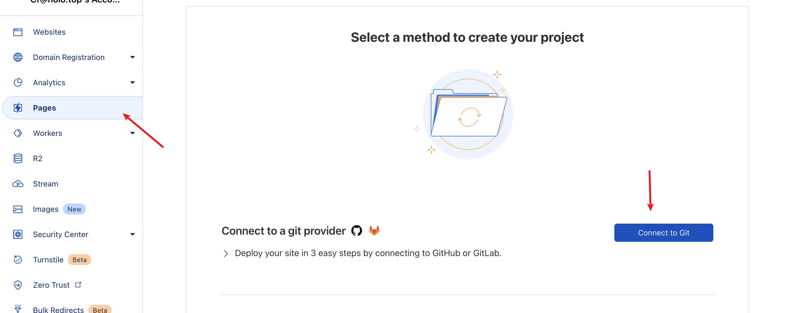
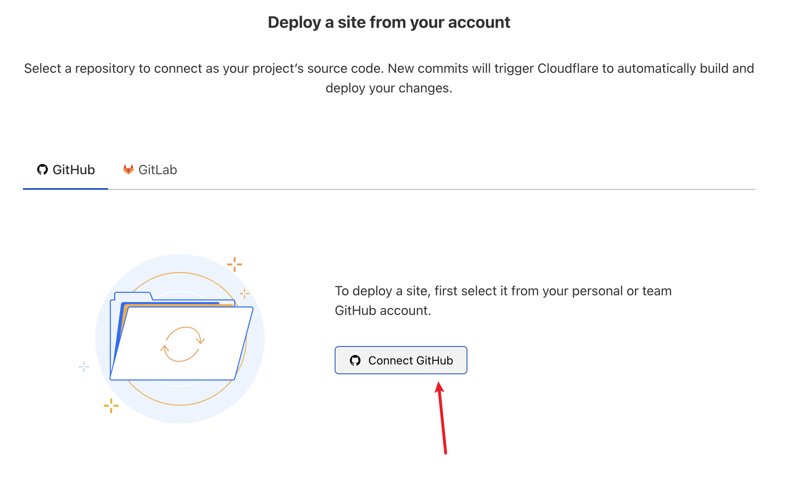
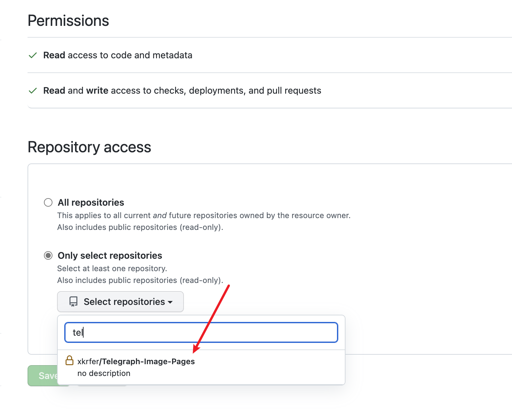
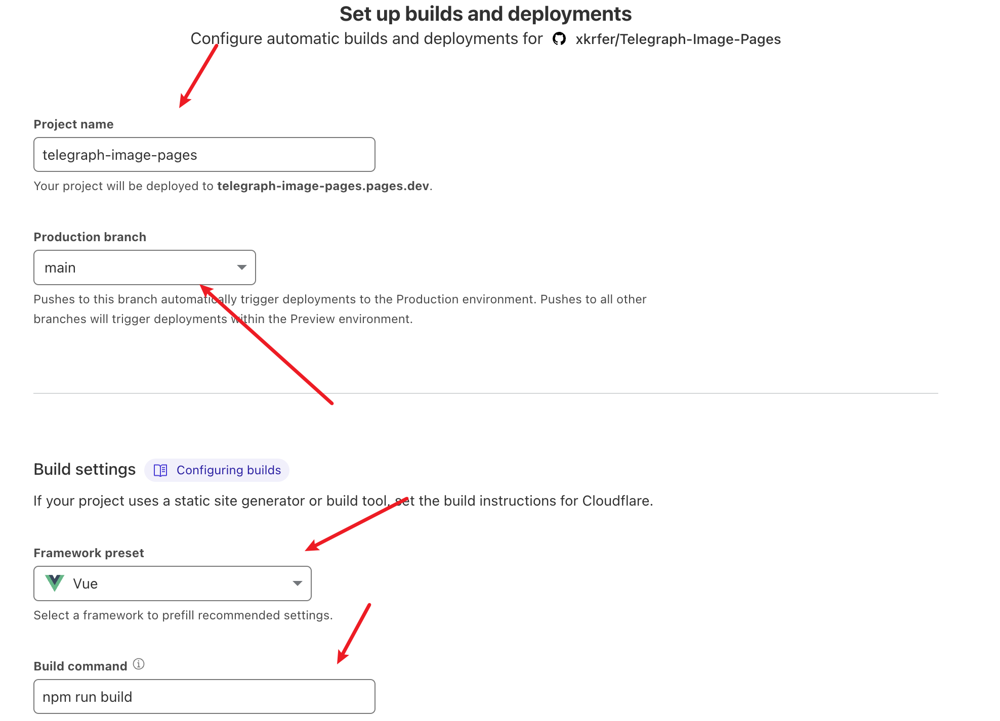
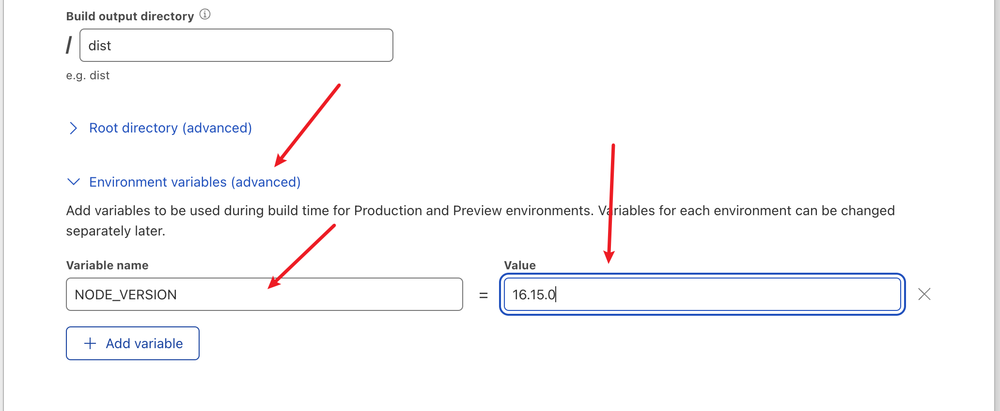
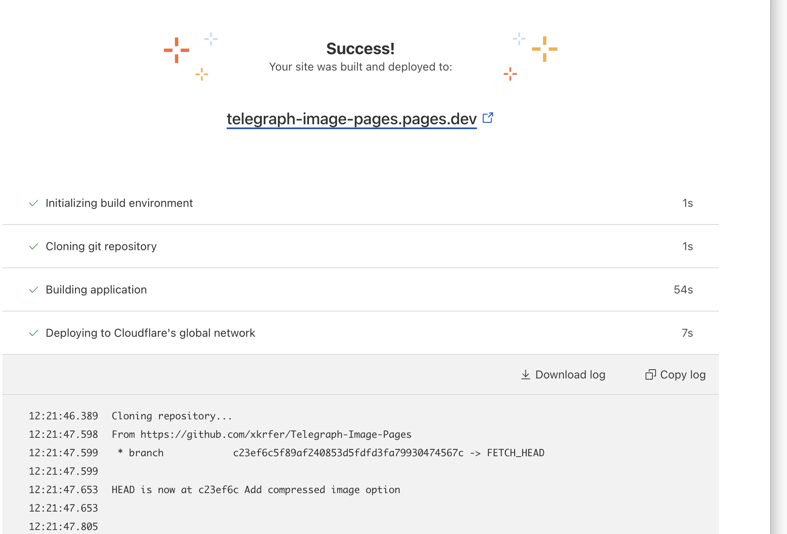
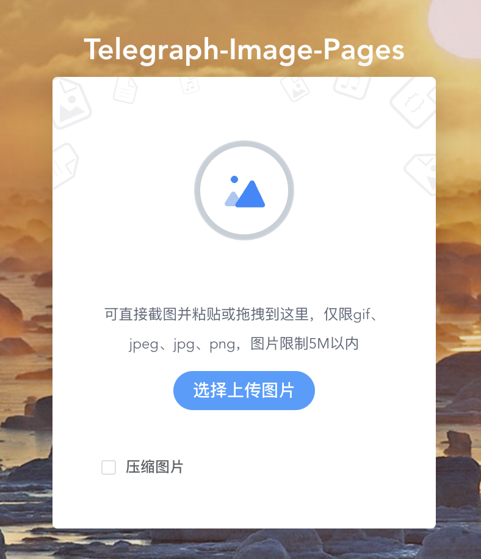
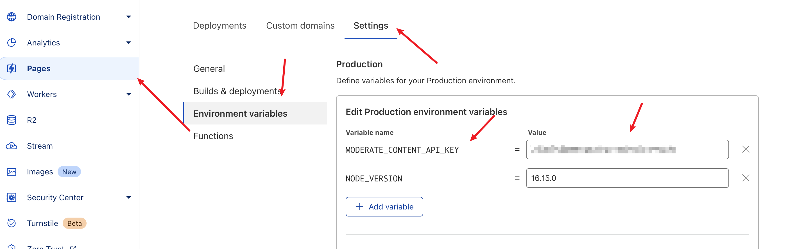
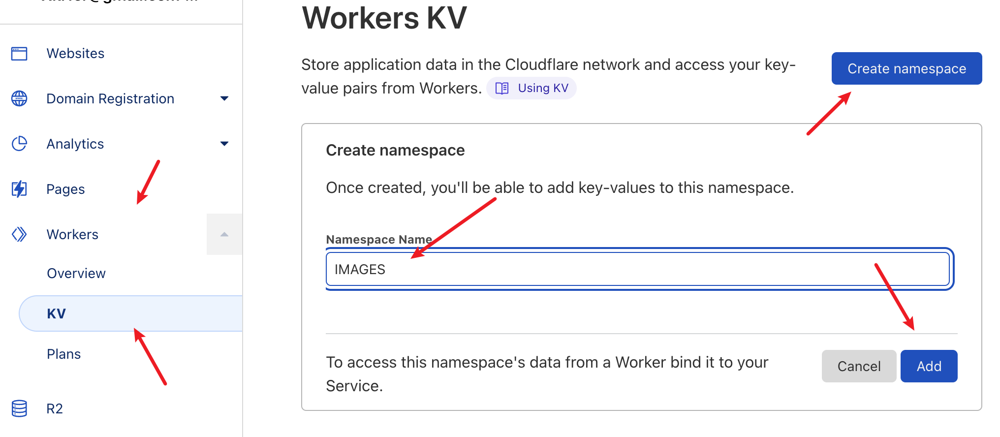
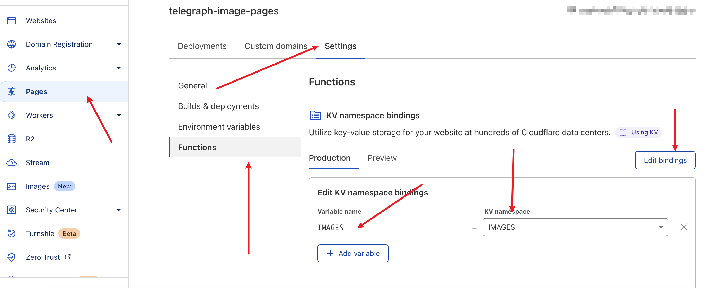

# Telegraph-Image-Pages

Self-built image hosting, using Cloudflare Pages and Telegraph, UI and Cloudflare Functions from [cf-pages/Telegraph-Image](https://github.com/cf-pages/Telegraph-Image)

## Feature

1. Paste, drag or upload images manually
2. Compress image
2. Image Moderation,  No adult content
2. Do not load images uploaded by other domains 

## How to use

1. You should prepare a [cloudflare](https://www.cloudflare.com/) account and [ github](https://github.com/) account.

2. Fork this repository

3. Open the Cloudflare pages and Connect your git
   
   
4. Select the repository you just forked
   

5. Configure the parameters required to build the project
   
   
6. After the configuration is complete, start the build
7. If there is no accident, the following figure appears to indicate that the build is successful
   
8. Click the link above to see that the project has been deployed successfully
   

## Tip
### Image Moderation
if you want no adult content, You can get API Key at [moderatecontent](https://www.moderatecontent.com/) and set environment variables at Cloudflare.

### Do not load images uploaded by other domains
1. Create a new KV store and name it as IMAGES

2. Bind in the project

## Thanks

This project has been transplanted on the basis of [cf-pages/Telegraph-Image](https://github.com/cf-pages/Telegraph-Image)
